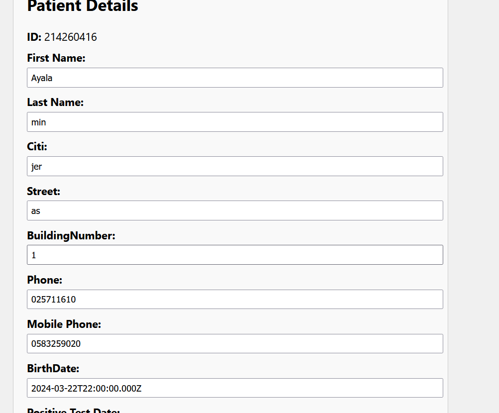

# Getting Started with Create React App

This project was bootstrapped with [Create React App](https://github.com/facebook/create-react-app).

## Available Scripts

In the project directory, you can run:

### `npm start`

Runs the app in the development mode.\
Open [http://localhost:3000](http://localhost:3000) to view it in your browser.

The page will reload when you make changes.\
You may also see any lint errors in the console.

### `npm test`

Launches the test runner in the interactive watch mode.\
See the section about [running tests](https://facebook.github.io/create-react-app/docs/running-tests) for more information.

### `npm run build`

Builds the app for production to the `build` folder.\
It correctly bundles React in production mode and optimizes the build for the best performance.

The build is minified and the filenames include the hashes.\
Your app is ready to be deployed!

See the section about [deployment](https://facebook.github.io/create-react-app/docs/deployment) for more information.

### `npm run eject`

**Note: this is a one-way operation. Once you `eject`, you can't go back!**

If you aren't satisfied with the build tool and configuration choices, you can `eject` at any time. This command will remove the single build dependency from your project.

Instead, it will copy all the configuration files and the transitive dependencies (webpack, Babel, ESLint, etc) right into your project so you have full control over them. All of the commands except `eject` will still work, but they will point to the copied scripts so you can tweak them. At this point you're on your own.

You don't have to ever use `eject`. The curated feature set is suitable for small and middle deployments, and you shouldn't feel obligated to use this feature. However we understand that this tool wouldn't be useful if you couldn't customize it when you are ready for it.

# CoronaHMO

# Schematic view of the information in the database:

- Members: ID(PK), MemberID, FirstName, LastName, AddressCity, AddressStreet, AddressNumber, BirthDate, Phone, MobilePhone.
- Vaccinations: ID(PK), MemberID(FK), DateReceived, Manufacturer.
- CovidCases: ID(PK), MemberID(FK), DateOfAttachment, DateOfRecovery.

# How to refer between the different services:
- Members: A service that allows creating, updating, reading and deleting members from the database.
- Vaccinations: A service that allows creating, reading  vaccinations from the database.
- CovidCases: A service that allows creating, reading  about the corona from the database.

- Members:
-In a GET request to a specific member, the request will be sent to the Members API and the information will be returned from it.
-In a GET request for all members, the request will be sent to the AllMembers API and the information will be returned from it.
-In a POST request from a member, the request will be sent to the Member API
-In a DELETE request from a member, the request will be sent to the Member API
-In a UPDATE request from a member, the request will be sent to the Member API
- Vaccinations:
-In a POST request from a Vaccinations, the request will be sent to the Vaccination API
-In a GET request for  Vaccinations, the request will be sent to the Vaccination API and the information will be returned from it.
- CovidCases:
-In a POST request from a CovidCases, the request will be sent to the CovidCases API
-In a GET request for  CovidCases, the request will be sent to the CovidCases API and the information will be returned from it.

# CoronaHMO
Run the project[client & server] with npm start and this is how you get to the home page. To add a user, click on the Sign up button. To see all members of the health fund, click any button. Display members of the health fund.

On the registration page, fill in all the details correctly and then click submit

On the display page for members of the health insurance fund there are many options

Option to click on the delete button and thus delete the member of the health insurance fund and with it all the information about him in the database:

Option to click all unvaccinated pacimets button and then it shows me the number of unvaccinated pacimets that exist in the database:

Option to see more details of a specific member by clicking any more details takes me to the details page of that particular member

When I click on the edit button, it brings me all the data in a form that can be edited

By clicking on the add vaccine button, the option of adding a vaccine opens up for me

Clicking finish updates my data

